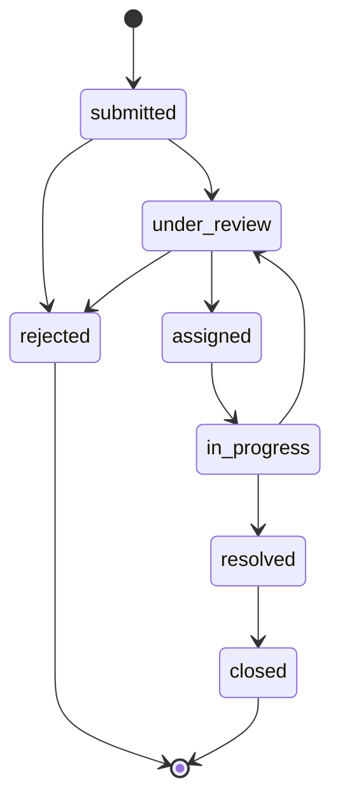

# Citizen Issue Report (CIR) — Full Project Specification

> **Version:** 1.0  
> **Last updated:** July 5, 2026  
> **Audience:** Full development team (Backend, Citizen Web, Mobile, Admin Desktop)  
> **Purpose:** Single source of truth for all features, procedures, and technical decisions.

---

## Table of Contents

1. [Project Overview](#1-project-overview)
2. [User Roles & Permissions](#2-user-roles--permissions)
3. [Technology Stack](#3-technology-stack)
4. [Repository Structure](#4-repository-structure)
5. [Complete Feature List by Application](#5-complete-feature-list-by-application)
6. [End-to-End Workflows & Procedures](#6-end-to-end-workflows--procedures)
7. [Issue Lifecycle & Status Machine](#7-issue-lifecycle--status-machine)
8. [Task Lifecycle (Worker / ClickUp-style)](#8-task-lifecycle-worker--clickup-style)
9. [AI Triage & Priority System](#9-ai-triage--priority-system)
10. [Database Schema](#10-database-schema)
11. [Complete API Reference](#11-complete-api-reference)
12. [Authentication & Security Procedures](#12-authentication--security-procedures)
13. [Notifications](#13-notifications)
14. [File Storage & Attachments](#14-file-storage--attachments)
15. [Internationalization (i18n)](#15-internationalization-i18n)
16. [Team Development Procedures](#16-team-development-procedures)
17. [Environment Setup Procedure](#17-environment-setup-procedure)
18. [Testing Procedures](#18-testing-procedures)
19. [Deployment Procedures](#19-deployment-procedures)
20. [Implementation Phases & Team Assignments](#20-implementation-phases--team-assignments)
21. [Glossary](#21-glossary)

---

## 1. Project Overview

### 1.1 Mission

**Citizen Issue Report (CIR)** is a civic engagement platform built for **Rwanda**. Citizens report local issues (roads, water, sanitation, health, etc.). The **government (Admin)** reviews reports, uses **AI-assisted triage** to understand and prioritize them, and **assigns tasks to Workers**. Workers execute tasks with **ClickUp-style** step tracking. Issues are **public** so other citizens can view, comment, and vote to increase or decrease urgency.

### 1.2 Target Users

| Role | Description | Primary Client |
|------|-------------|----------------|
| **Citizen** | Rwandan resident who reports and tracks issues | Web (Laravel), Mobile (React Native) |
| **Worker** | Government field worker assigned to resolve issues | Mobile (React Native) |
| **Admin** | Government official who triages, assigns, and oversees | Desktop (Electron + React) |

### 1.3 Core Principles

- **Rwanda-first:** Phone numbers must use `+250` format; districts aligned with Rwanda administrative divisions.
- **Transparency:** Issues are public by default (reporter can choose anonymous display name).
- **AI-assisted, human-controlled:** AI suggests category and priority; Admin has final override.
- **Community-driven urgency:** Citizens vote to raise or lower issue priority.
- **Accountability:** Every status change, assignment, and admin action is logged.

### 1.4 Architecture Overview

```
┌─────────────────────────────────────────────────────────────────────┐
│                         CLIENT APPLICATIONS                          │
├──────────────────┬──────────────────┬──────────────────────────────┤
│  Citizen Web     │  Citizen Mobile  │  Worker Mobile               │
│  Laravel+Inertia │  React Native    │  React Native                │
├──────────────────┴──────────────────┴──────────────────────────────┤
│                    Admin Desktop (Electron + React)                 │
└──────────────────────────────┬──────────────────────────────────────┘
                               │ HTTPS / REST API v1
                               ▼
┌─────────────────────────────────────────────────────────────────────┐
│                      LARAVEL 11 BACKEND                              │
│  Sanctum Auth │ REST API │ Queue Jobs │ AI Service │ Notifications │
└──────────────────────────────┬──────────────────────────────────────┘
                               │
              ┌────────────────┼────────────────┐
              ▼                ▼                ▼
         PostgreSQL          Redis           S3 / Local
         (primary DB)    (queue, cache)    (attachments)
```

---

## 2. User Roles & Permissions

### 2.1 Permission Matrix

| Action | Citizen | Worker | Admin |
|--------|:-------:|:------:|:-----:|
| Register / login via +250 OTP | ✅ | ✅ | ✅ |
| Login via email+password | ❌ | ❌ | ✅ |
| Submit issue report | ✅ | ❌ | ❌ |
| View public issue feed | ✅ | ✅ | ✅ |
| Vote on issue priority | ✅ | ❌ | ❌ |
| Comment on public issues | ✅ | ❌ | ✅ |
| View own submitted issues | ✅ | ❌ | ✅ |
| View all issues (admin queue) | ❌ | ❌ | ✅ |
| Override AI/citizen priority | ❌ | ❌ | ✅ |
| Change issue status | ❌ | ❌ | ✅ |
| Create & assign tasks | ❌ | ❌ | ✅ |
| Invite / deactivate workers | ❌ | ❌ | ✅ |
| View assigned tasks | ❌ | ✅ | ✅ |
| Update task status & steps | ❌ | ✅ | ❌ |
| Post task progress updates | ❌ | ✅ | ❌ |
| Add internal task comments | ❌ | ✅ | ✅ |
| View citizen phone number | ❌ | ❌ | ✅ |
| View analytics dashboard | ❌ | ❌ | ✅ |
| Moderate flagged comments | ❌ | ❌ | ✅ |
| Bulk assign / bulk status change | ❌ | ❌ | ✅ |

### 2a. Role Assignment Rules

- **Citizen:** Auto-created on first successful OTP login with role `citizen`.
- **Worker:** Created by Admin invitation only. Admin sends invite SMS to `+250` number; worker completes OTP to activate account.
- **Admin:** Seeded at project init (super-admin). Additional admins created by super-admin only.
- A user has **exactly one role** (no multi-role accounts in v1).

---

## 3. Technology Stack

### 3.1 Backend & Citizen Web

| Component | Technology | Version |
|-----------|------------|---------|
| Framework | Laravel | 11.x |
| Language | PHP | 8.3+ |
| API Auth | Laravel Sanctum | Latest |
| Citizen Web UI | Inertia.js + React | Latest |
| CSS | Tailwind CSS | 3.x |
| Database | PostgreSQL | 16 |
| Queue | Redis + Laravel Horizon | Latest |
| Testing | Pest PHP | Latest |
| SMS (OTP) | Africa's Talking | Production |
| SMS (dev) | Mailpit / log driver | Development |
| AI | OpenAI GPT-4o-mini | Production |
| AI (dev) | Mock service / Ollama | Development |
| File storage | Laravel Filesystem → AWS S3 | Production |

### 3.2 Citizen Mobile App

| Component | Technology |
|-----------|------------|
| Framework | React Native (Expo recommended) |
| Language | TypeScript |
| Navigation | React Navigation |
| State / API | TanStack Query + axios |
| Auth token storage | expo-secure-store |
| Camera / photos | expo-image-picker |
| Push notifications | Firebase Cloud Messaging (FCM) |
| Maps (optional) | react-native-maps |

### 3.3 Worker Mobile App

| Component | Technology |
|-----------|------------|
| Framework | React Native (Expo recommended) |
| Language | TypeScript |
| Navigation | React Navigation |
| State / API | TanStack Query + axios |
| Offline cache | AsyncStorage + sync queue |
| Push notifications | FCM |
| Kanban UI | Custom or `@hello-pangea/dnd` adapted for RN |

### 3.4 Admin Desktop App

| Component | Technology |
|-----------|------------|
| Shell | Electron |
| UI | React + Vite |
| Language | TypeScript |
| State / API | TanStack Query + axios |
| Charts | Recharts or Chart.js |
| Routing | React Router |
| Styling | Tailwind CSS |

### 3.5 Shared Package

| Component | Technology |
|-----------|------------|
| Location | `shared/` monorepo folder |
| Contents | TypeScript types, API endpoint constants, enums (statuses, roles, priorities) |
| Consumed by | citizen-app, worker-app, admin-desktop |

---

## 4. Repository Structure

```
Cursor_Hackaton/
├── backend/                        # Laravel 11 — API + Citizen Web
│   ├── app/
│   │   ├── Http/
│   │   │   ├── Controllers/Api/V1/
│   │   │   ├── Middleware/
│   │   │   └── Resources/
│   │   ├── Models/
│   │   ├── Services/
│   │   │   ├── AiTriageService.php
│   │   │   ├── PriorityService.php
│   │   │   ├── OtpService.php
│   │   │   └── NotificationService.php
│   │   ├── Jobs/
│   │   │   ├── ProcessIssueAiTriage.php
│   │   │   └── SendPushNotification.php
│   │   └── Events/
│   ├── database/
│   │   ├── migrations/
│   │   └── seeders/
│   ├── routes/
│   │   ├── api.php
│   │   └── web.php                 # Inertia citizen pages
│   ├── resources/js/               # Inertia React pages
│   └── tests/
│
├── mobile/
│   ├── citizen-app/                # React Native — Citizen
│   └── worker-app/                 # React Native — Worker
│
├── admin-desktop/                  # Electron + React
│   ├── src/
│   │   ├── main/                   # Electron main process
│   │   └── renderer/               # React UI
│   └── electron-builder config
│
├── shared/                         # Shared TS types & constants
│   ├── types/
│   └── constants/
│
├── docker-compose.yml              # PostgreSQL + Redis + Mailpit
├── .env.example                    # Root env template
└── CIR_PROJECT_SPEC.md             # This document
```

---

## 5. Complete Feature List by Application

### 5.1 Citizen Web (Laravel + Inertia + React)

#### Authentication
- [ ] Phone number input with `+250` prefix locked
- [ ] OTP request (6-digit code, 5-minute expiry)
- [ ] OTP verification → login / auto-register
- [ ] Session persistence (Sanctum token in httpOnly cookie or localStorage)
- [ ] Logout

#### Issue Reporting
- [ ] Report form fields:
  - Reporter name (required)
  - Title (required, max 200 chars)
  - Description (required, max 5000 chars)
  - District (required, dropdown — Rwanda districts)
  - Sector (optional)
  - Location on map (optional — lat/lng pin)
  - Photo upload (optional, max 5 images, 5MB each)
  - Citizen priority (1–5 slider: Low → Critical)
  - Anonymous display toggle (hide reporter name on public feed)
- [ ] Form validation with inline errors
- [ ] Success confirmation with issue reference number
- [ ] Redirect to issue detail after submit

#### Public Issue Feed
- [ ] Paginated list of public issues
- [ ] Sort by: final priority (default), newest, most voted
- [ ] Filter by: district, status, category (AI-assigned)
- [ ] Search by title/keywords
- [ ] Each card shows: title, district, status badge, priority score, vote count, comment count, date
- [ ] Click to open issue detail

#### Issue Detail (Public)
- [ ] Full description, photos, district, status timeline
- [ ] AI category tag and summary (public-safe version)
- [ ] Priority breakdown: citizen / AI / community scores
- [ ] Vote buttons: "Increase urgency" (+1) / "Decrease urgency" (-1)
- [ ] One vote per citizen per issue (can change vote)
- [ ] Public comment thread (newest first, paginated)
- [ ] Add comment (requires login)
- [ ] Flag comment as inappropriate
- [ ] High-level resolution progress (status only — no internal worker notes)

#### My Reports (Authenticated Citizen)
- [ ] List of issues submitted by logged-in citizen
- [ ] Status tracking per issue
- [ ] Notification badge for status changes

#### Profile
- [ ] View/edit display name
- [ ] View phone number (read-only)
- [ ] Language preference (EN / FR / RW)

#### General
- [ ] Responsive mobile layout
- [ ] Loading states and error boundaries
- [ ] i18n support (Kinyarwanda, English, French)

---

### 5.2 Citizen Mobile App (React Native)

All Citizen Web features, plus:

- [ ] Native camera integration for issue photos
- [ ] GPS auto-location for district suggestion
- [ ] Push notifications:
  - Issue status changed
  - Issue resolved
  - Comment reply (if admin responds publicly)
- [ ] Offline draft: save report locally, submit when online
- [ ] Pull-to-refresh on feed
- [ ] Deep linking to issue detail (`cir://issues/{id}`)
- [ ] Biometric re-auth option (after initial OTP login)

---

### 5.3 Worker Mobile App (React Native) — ClickUp-style

#### Authentication
- [ ] OTP login (+250, worker role verified server-side)
- [ ] Persistent session with secure token storage

#### Task List View
- [ ] List of all tasks assigned to logged-in worker
- [ ] Filter by status: `todo`, `in_progress`, `review`, `done`
- [ ] Sort by: due date, priority, date assigned
- [ ] Search by issue title or task ID
- [ ] Badge count for new/unread assignments
- [ ] Pull-to-refresh

#### Kanban Board View
- [ ] Horizontal scroll columns: To Do | In Progress | Review | Done
- [ ] Drag-and-drop task cards between columns (updates status via API)
- [ ] Task card shows: issue title, district, priority, due date, step progress (e.g. 2/5)

#### Task Detail View
- [ ] Linked issue summary (title, description, district, photos)
- [ ] Task metadata: assigned date, due date, priority, admin notes
- [ ] **Checklist / Steps** (ClickUp subtask style):
  - View ordered list of steps
  - Mark step complete/incomplete (checkbox)
  - Add new step (worker can add field steps; admin-defined steps are read-only label)
  - Reorder steps (drag handle)
  - Each step: title, optional description, completed_at timestamp
- [ ] **Progress Updates Timeline**:
  - Post text update
  - Attach photo to update (camera or gallery)
  - Each update shows timestamp and appears in chronological timeline
  - Visible to Admin (not public)
- [ ] **Internal Comments Thread**:
  - Worker ↔ Admin communication
  - Not visible to citizens
- [ ] **Attachments Tab**:
  - View all photos/documents attached to task
  - Upload new attachment (photo, PDF)
- [ ] **Time Log** (optional v1.1):
  - Start/stop timer on task
  - Manual time entry

#### Task Actions
- [ ] Change task status (with required progress update on status change to `review` or `done`)
- [ ] Request admin clarification (posts internal comment tagged `clarification_request`)
- [ ] Mark task as blocked (with reason)

#### Notifications
- [ ] New task assigned
- [ ] Admin comment on task
- [ ] Due date reminder (24h before)
- [ ] Task reassigned

#### Offline Support
- [ ] Cache assigned tasks and steps locally
- [ ] Queue progress updates and comments when offline
- [ ] Sync on reconnect with conflict resolution (server wins)

---

### 5.4 Admin Desktop App (Electron + React)

#### Authentication
- [ ] OTP login (+250) OR email + password
- [ ] Role verification (admin only)
- [ ] Remember session (encrypted local storage)
- [ ] Auto-logout after 8 hours inactivity

#### Issue Inbox (Main View)
- [ ] Table/list of all submitted issues
- [ ] Columns: ID, title, district, citizen priority, AI priority, community score, final priority, status, date, AI category
- [ ] Default sort: final priority DESC
- [ ] Filters: status, district, category, date range, priority range
- [ ] Full-text search
- [ ] Bulk select + bulk actions (change status, assign worker)
- [ ] Color-coded priority indicators (1=green → 5=red)
- [ ] Unread/new issue badge

#### Issue Detail Panel
- [ ] Full citizen report (name, phone, title, description, photos, location)
- [ ] AI analysis panel:
  - AI summary
  - Suggested category and tags
  - AI priority with confidence indicator
  - Duplicate warning (similar open issues listed with links)
- [ ] Community activity: vote count breakdown, recent comments
- [ ] Priority override slider (admin sets manual override → updates final_priority)
- [ ] Status change dropdown
- [ ] Activity log (all changes with timestamp and actor)
- [ ] "Create Task & Assign Worker" button

#### Task Assignment Flow
- [ ] Modal: select worker from active worker list
- [ ] Set due date
- [ ] Add admin notes / instructions
- [ ] Pre-populate checklist steps (template or manual)
- [ ] Confirm → creates Task linked to Issue, sends push notification to worker
- [ ] Issue status auto-changes to `assigned`

#### Worker Management
- [ ] List all workers (name, phone, status, active task count)
- [ ] Invite new worker (enter +250 phone → sends invite SMS)
- [ ] Deactivate / reactivate worker
- [ ] View worker's current and past tasks

#### Task Oversight
- [ ] View all tasks across all workers
- [ ] Filter by worker, status, district
- [ ] Open task detail: steps progress, worker updates timeline, internal comments
- [ ] Admin can add internal comment
- [ ] Admin can reassign task to different worker
- [ ] Admin can mark task as approved (issue → `resolved`) or rejected (back to `in_progress`)

#### Analytics Dashboard
- [ ] KPI cards: total open issues, resolved this month, avg resolution time, active workers
- [ ] Chart: issues by district (bar chart)
- [ ] Chart: issues by category (pie chart)
- [ ] Chart: issues over time (line chart — submitted vs resolved)
- [ ] Chart: worker performance (tasks completed per worker)
- [ ] Export data as CSV

#### Comment Moderation
- [ ] Queue of flagged public comments
- [ ] Approve (dismiss flag) or Delete comment
- [ ] Ban citizen from commenting (admin action on user)

#### Settings
- [ ] AI prompt template editor (advanced — super-admin only)
- [ ] Priority weight configuration (citizen/AI/community weights)
- [ ] Notification templates
- [ ] District list management

#### General Desktop Features
- [ ] System tray icon with unread issue count
- [ ] Desktop notifications for new high-priority issues
- [ ] Keyboard shortcuts (e.g. `J/K` navigate inbox, `A` assign)
- [ ] Auto-update via electron-updater (optional)

---

### 5.5 Backend (Laravel API) Features

- [ ] RESTful API v1 with consistent JSON envelope
- [ ] Sanctum token authentication
- [ ] Role-based middleware on all protected routes
- [ ] OTP generation, storage (Redis, 5-min TTL), verification
- [ ] Rate limiting on OTP endpoints
- [ ] Issue CRUD with validation
- [ ] AI triage queue job (async on issue creation)
- [ ] Priority computation service (recalculates on vote/override)
- [ ] Vote and comment management
- [ ] Task and task step CRUD
- [ ] File upload handling (validation, storage, URL generation)
- [ ] Push notification dispatch (FCM)
- [ ] SMS dispatch (Africa's Talking)
- [ ] Audit log on all admin actions
- [ ] API pagination (cursor or offset, consistent across endpoints)
- [ ] API Resources for all models (consistent response shapes)
- [ ] Form Request validation classes
- [ ] Database seeders: districts, super-admin, sample data
- [ ] Horizon dashboard for queue monitoring
- [ ] CORS configuration for all client origins

---

## 6. End-to-End Workflows & Procedures

### 6.1 Procedure: Citizen Reports an Issue

```
Citizen → Opens app/web → Logs in via +250 OTP
       → Fills report form (name, title, description, district, priority, optional photo)
       → Submits
       → Backend validates → saves Issue (status: submitted)
       → Dispatches ProcessIssueAiTriage job (async)
       → Returns issue ID to citizen
       → AI job runs → sets ai_category, ai_summary, ai_priority, ai_tags
       → PriorityService recalculates final_priority
       → Issue appears in public feed and admin inbox
       → Citizen receives confirmation
```

**Business rules:**
- Citizen must be authenticated to submit.
- At least title + description + district required.
- Max 5 photos per issue.
- Issue is public by default unless citizen toggles anonymous name.

---

### 6.2 Procedure: AI Triage (Automatic)

```
Trigger: IssueCreated event
Job: ProcessIssueAiTriage

Step 1: Load issue title + description
Step 2: Call AiTriageService.analyze(issue)
        → Prompt: classify, summarize, score priority 1-5, extract tags
        → Response parsed and validated
Step 3: Save ai_summary, ai_category, ai_tags, ai_priority to issue
Step 4: Check for duplicates (compare embedding similarity with open issues)
        → If similarity > 0.85: set duplicate_of_id, flag in admin UI
Step 5: PriorityService.computeFinalPriority(issue)
Step 6: If ai_priority >= 4: send urgent notification to admin
Step 7: Log AI processing in issue_activity_log
```

**Failure handling:**
- If AI API fails: retry 3 times with exponential backoff.
- After 3 failures: set `ai_priority = null`, flag issue as `ai_pending` for manual review.
- Admin inbox shows "AI pending" badge.

---

### 6.3 Procedure: Community Voting

```
Citizen → Views issue detail → Clicks "Increase urgency" or "Decrease urgency"
       → POST /api/v1/issues/{id}/votes { direction: "up" | "down" }
       → Backend upserts issue_votes (one vote per user per issue)
       → Recalculates community_score = SUM(vote values) for issue
       → PriorityService recalculates final_priority
       → Returns updated scores
       → UI updates vote count and priority display
```

**Business rules:**
- Must be authenticated citizen.
- One vote per citizen per issue; changing vote updates existing record.
- Vote values: up = +1, down = -1.
- community_score normalized to 0–5 scale for priority formula.

---

### 6.4 Procedure: Admin Reviews & Assigns Task

```
Admin → Opens Electron app → Logs in
     → Views issue inbox sorted by final_priority
     → Opens issue detail → Reviews AI summary + citizen report + community activity
     → (Optional) Overrides priority or changes status to under_review
     → Clicks "Assign Worker"
     → Selects worker, sets due date, adds notes, defines checklist steps
     → POST /api/v1/admin/tasks
     → Backend creates Task + TaskSteps
     → Issue status → assigned
     → Push notification sent to worker
     → Audit log entry created
```

**Business rules:**
- Only admin can assign tasks.
- One issue can have multiple tasks (e.g. different departments), but v1 defaults to 1 task per issue.
- Worker must be active (not deactivated).

---

### 6.5 Procedure: Worker Executes Task

```
Worker → Receives push notification → Opens worker app
      → Views task in list or kanban
      → Opens task detail → Reviews issue context and admin notes
      → Works through checklist steps (mark complete one by one)
      → Posts progress updates with photos as work proceeds
      → Adds internal comments if clarification needed
      → When all steps done: changes status to "review"
      → Admin receives notification
      → Admin reviews → approves (issue → resolved) or rejects (task → in_progress)
      → Worker receives notification of outcome
```

**Business rules:**
- Worker can only see tasks assigned to them.
- Status change to `review` requires at least one progress update.
- Status change to `done` can only be done by admin approval in v1.

---

### 6.6 Procedure: Issue Resolution & Public Update

```
Admin approves worker task
→ Task status → done
→ Issue status → resolved
→ issue.resolved_at = now()
→ Public issue feed shows "Resolved" badge
→ Citizen who submitted receives push notification / SMS
→ Activity log updated
→ (Optional) Admin adds public resolution note visible on issue detail
```

---

### 6.7 Procedure: Worker Invitation

```
Admin → Worker Management → Invite Worker
     → Enters name + +250 phone number
     → POST /api/v1/admin/workers/invite
     → Backend creates user (role: worker, status: invited)
     → Sends SMS: "You have been invited to CIR Worker App. Download: [link]. Login with your phone number."
     → Worker downloads app → OTP login → account activated (status: active)
```

---

### 6.8 Procedure: Comment Moderation

```
Citizen flags comment → POST /api/v1/issues/{id}/comments/{commentId}/flag
→ Comment flagged_count += 1
→ If flagged_count >= 3: auto-hide comment (is_visible = false)
→ Admin sees in moderation queue
→ Admin approves (restore) or deletes
→ Audit log entry
```

---

## 7. Issue Lifecycle & Status Machine

### 7.1 Status Values

| Status | Description | Visible to Public |
|--------|-------------|:-----------------:|
| `submitted` | Just created, AI processing | ✅ |
| `under_review` | Admin is reviewing | ✅ |
| `assigned` | Task created and assigned to worker | ✅ |
| `in_progress` | Worker actively working | ✅ |
| `resolved` | Work completed and approved | ✅ |
| `closed` | Archived (no further action) | ✅ |
| `rejected` | Invalid/duplicate/spam (admin action) | ❌ (hidden) |

### 7.2 Valid Transitions

```
submitted      → under_review | rejected
under_review   → assigned | rejected
assigned       → in_progress
in_progress    → resolved | under_review (if sent back)
resolved       → closed
```

**Who can transition:**
- `submitted → under_review`: Admin (automatic after AI completes) or Admin manual
- `under_review → assigned`: Admin (via task assignment)
- `assigned → in_progress`: Worker (when they start work)
- `in_progress → resolved`: Admin (approves worker completion)
- `any → rejected`: Admin only
- `resolved → closed`: Admin only (auto-close after 30 days optional)

### 7.3 Status Diagram



---

## 8. Task Lifecycle (Worker / ClickUp-style)

### 8.1 Task Status Values

| Status | Description |
|--------|-------------|
| `todo` | Assigned, not yet started |
| `in_progress` | Worker actively working |
| `review` | Worker submitted for admin approval |
| `done` | Admin approved completion |
| `blocked` | Worker flagged blocker |

### 8.2 Valid Task Transitions

```
todo        → in_progress | blocked
in_progress → review | blocked | todo
review      → done | in_progress (admin rejects)
blocked     → in_progress (blocker resolved)
done        → (terminal)
```

### 8.3 Task Step Rules

- Steps created by Admin at assignment time (required steps).
- Worker can add additional steps (marked `added_by: worker`).
- Steps have: `title`, `description` (optional), `order`, `is_completed`, `completed_at`.
- Completing all required steps enables status change to `review`.
- Step reorder: worker can reorder worker-added steps; admin steps fixed order.

### 8.4 Progress Update Rules

- Required fields: `body` (text, min 10 chars).
- Optional: photo attachment.
- Required when changing status to `review` or `done`.
- Visible to Admin and assigned Worker only (not public).

---

## 9. AI Triage & Priority System

### 9.1 AI Input

```json
{
  "title": "Large pothole on KG 11 Ave",
  "description": "There is a deep pothole near the market causing accidents...",
  "district": "Gasabo"
}
```

### 9.2 AI Output (structured)

```json
{
  "category": "roads",
  "tags": ["pothole", "accident-risk", "market-area"],
  "summary": "Deep pothole on KG 11 Ave near market in Gasabo. Safety hazard for vehicles and pedestrians.",
  "priority": 4,
  "confidence": 0.87,
  "language_detected": "en"
}
```

### 9.3 AI Categories (Predefined)

- `roads` — Roads, potholes, bridges
- `water` — Water supply, pipes, drainage
- `electricity` — Power outages, street lights
- `sanitation` — Waste, sewage, cleanliness
- `health` — Public health hazards
- `education` — Schools, educational facilities
- `security` — Safety concerns
- `environment` — Pollution, trees, parks
- `other` — Unclassified

### 9.4 Priority Formula

```
community_normalized = clamp( (community_score + max_score) / (2 * max_score) * 5, 0, 5 )

final_priority = round(
    0.30 * citizen_priority +
    0.40 * ai_priority +
    0.30 * community_normalized,
    1
)
```

- Result clamped to 1–5.
- Admin override: if `admin_priority_override` is set, it replaces `final_priority` entirely.
- Weights configurable in admin settings (must sum to 1.0).

### 9.5 Duplicate Detection (Phase 3)

- On AI triage: compute text embedding of title + description.
- Compare cosine similarity with open issues in same district.
- If similarity ≥ 0.85: link as `duplicate_of_id`, notify admin.
- Admin decides: merge, close duplicate, or dismiss.

---

## 10. Database Schema

### 10.1 `users`

| Column | Type | Notes |
|--------|------|-------|
| id | bigint PK | |
| name | varchar(255) | |
| phone | varchar(20) UNIQUE | E.164 +250... |
| email | varchar(255) NULL UNIQUE | Admin only |
| password | varchar(255) NULL | Admin only (bcrypt) |
| role | enum | citizen, worker, admin |
| status | enum | active, invited, deactivated |
| language | varchar(5) | en, fr, rw |
| created_at | timestamp | |
| updated_at | timestamp | |

### 10.2 `otp_codes`

| Column | Type | Notes |
|--------|------|-------|
| id | bigint PK | |
| phone | varchar(20) | |
| code | varchar(6) | |
| expires_at | timestamp | 5 min TTL |
| verified | boolean | default false |

### 10.3 `issues`

| Column | Type | Notes |
|--------|------|-------|
| id | bigint PK | |
| reference_number | varchar(20) UNIQUE | e.g. CIR-2026-00001 |
| user_id | FK → users | Reporter |
| reporter_name | varchar(255) | |
| is_anonymous | boolean | default false |
| title | varchar(200) | |
| description | text | |
| district | varchar(100) | |
| sector | varchar(100) NULL | |
| latitude | decimal(10,7) NULL | |
| longitude | decimal(10,7) NULL | |
| status | enum | See §7 |
| citizen_priority | tinyint | 1–5 |
| ai_priority | tinyint NULL | 1–5 |
| ai_category | varchar(50) NULL | |
| ai_summary | text NULL | |
| ai_tags | json NULL | |
| ai_confidence | decimal(3,2) NULL | |
| community_score | integer | default 0 |
| final_priority | decimal(3,1) | computed |
| admin_priority_override | tinyint NULL | |
| duplicate_of_id | FK → issues NULL | |
| is_public | boolean | default true |
| resolved_at | timestamp NULL | |
| created_at | timestamp | |
| updated_at | timestamp | |

### 10.4 `issue_photos`

| Column | Type | Notes |
|--------|------|-------|
| id | bigint PK | |
| issue_id | FK → issues | |
| path | varchar(500) | S3/local path |
| url | varchar(500) | Public URL |
| order | tinyint | |

### 10.5 `issue_votes`

| Column | Type | Notes |
|--------|------|-------|
| id | bigint PK | |
| issue_id | FK → issues | |
| user_id | FK → users | |
| direction | enum | up, down |
| created_at | timestamp | |
| updated_at | timestamp | |
| UNIQUE(issue_id, user_id) | | |

### 10.6 `issue_comments`

| Column | Type | Notes |
|--------|------|-------|
| id | bigint PK | |
| issue_id | FK → issues | |
| user_id | FK → users | |
| body | text | |
| is_visible | boolean | default true |
| flagged_count | integer | default 0 |
| created_at | timestamp | |
| updated_at | timestamp | |

### 10.7 `issue_activity_logs`

| Column | Type | Notes |
|--------|------|-------|
| id | bigint PK | |
| issue_id | FK → issues | |
| user_id | FK → users NULL | |
| action | varchar(100) | e.g. status_changed, ai_processed |
| metadata | json NULL | |
| created_at | timestamp | |

### 10.8 `tasks`

| Column | Type | Notes |
|--------|------|-------|
| id | bigint PK | |
| issue_id | FK → issues | |
| assigned_to | FK → users | Worker |
| assigned_by | FK → users | Admin |
| title | varchar(255) | |
| admin_notes | text NULL | |
| status | enum | See §8 |
| due_date | date NULL | |
| created_at | timestamp | |
| updated_at | timestamp | |

### 10.9 `task_steps`

| Column | Type | Notes |
|--------|------|-------|
| id | bigint PK | |
| task_id | FK → tasks | |
| title | varchar(255) | |
| description | text NULL | |
| order | integer | |
| is_completed | boolean | default false |
| completed_at | timestamp NULL | |
| added_by | enum | admin, worker |
| created_at | timestamp | |

### 10.10 `task_status_updates`

| Column | Type | Notes |
|--------|------|-------|
| id | bigint PK | |
| task_id | FK → tasks | |
| user_id | FK → users | |
| body | text | |
| created_at | timestamp | |

### 10.11 `task_comments`

| Column | Type | Notes |
|--------|------|-------|
| id | bigint PK | |
| task_id | FK → tasks | |
| user_id | FK → users | |
| body | text | |
| type | enum | comment, clarification_request |
| created_at | timestamp | |

### 10.12 `task_attachments`

| Column | Type | Notes |
|--------|------|-------|
| id | bigint PK | |
| task_id | FK → tasks | |
| user_id | FK → users | |
| path | varchar(500) | |
| url | varchar(500) | |
| mime_type | varchar(100) | |
| created_at | timestamp | |

### 10.13 `audit_logs`

| Column | Type | Notes |
|--------|------|-------|
| id | bigint PK | |
| user_id | FK → users | |
| action | varchar(100) | |
| entity_type | varchar(50) | |
| entity_id | bigint | |
| metadata | json NULL | |
| ip_address | varchar(45) | |
| created_at | timestamp | |

### 10.14 `device_tokens` (Push Notifications)

| Column | Type | Notes |
|--------|------|-------|
| id | bigint PK | |
| user_id | FK → users | |
| token | varchar(500) | FCM token |
| platform | enum | ios, android, web |
| created_at | timestamp | |

---

## 11. Complete API Reference

**Base URL:** `https://api.cir.rw/api/v1` (production)  
**Local:** `http://localhost:8000/api/v1`

**Auth header:** `Authorization: Bearer {sanctum_token}`

**Standard response envelope:**
```json
{
  "data": { ... },
  "meta": { "current_page": 1, "last_page": 5, "total": 48 },
  "message": "Success"
}
```

**Standard error envelope:**
```json
{
  "message": "Validation failed",
  "errors": { "title": ["The title field is required."] }
}
```

---

### 11.1 Authentication

| Method | Endpoint | Auth | Description |
|--------|----------|------|-------------|
| POST | `/auth/otp/request` | Public | Request OTP. Body: `{ "phone": "+250788123456" }` |
| POST | `/auth/otp/verify` | Public | Verify OTP. Body: `{ "phone": "+250788123456", "code": "123456" }` |
| POST | `/auth/login` | Public | Admin email+password. Body: `{ "email", "password" }` |
| POST | `/auth/logout` | Auth | Revoke current token |
| GET | `/auth/me` | Auth | Current user profile |

---

### 11.2 Issues (Citizen + Public)

| Method | Endpoint | Auth | Role | Description |
|--------|----------|------|------|-------------|
| GET | `/issues` | Optional | Any | Public feed. Query: `page, district, status, category, sort, search` |
| GET | `/issues/{id}` | Optional | Any | Issue detail with votes, comments |
| POST | `/issues` | Required | citizen | Create issue report |
| GET | `/issues/mine` | Required | citizen | My submitted issues |
| POST | `/issues/{id}/votes` | Required | citizen | Vote. Body: `{ "direction": "up"\|"down" }` |
| DELETE | `/issues/{id}/votes` | Required | citizen | Remove vote |
| GET | `/issues/{id}/comments` | Optional | Any | List comments |
| POST | `/issues/{id}/comments` | Required | citizen | Add comment. Body: `{ "body" }` |
| POST | `/issues/{id}/comments/{cid}/flag` | Required | citizen | Flag comment |

---

### 11.3 Admin — Issues

| Method | Endpoint | Auth | Role | Description |
|--------|----------|------|------|-------------|
| GET | `/admin/issues` | Required | admin | Full issue queue with AI data |
| GET | `/admin/issues/{id}` | Required | admin | Full detail incl. citizen phone |
| PATCH | `/admin/issues/{id}` | Required | admin | Update status, priority override |
| POST | `/admin/issues/{id}/public-note` | Required | admin | Add public resolution note |

---

### 11.4 Admin — Tasks

| Method | Endpoint | Auth | Role | Description |
|--------|----------|------|------|-------------|
| GET | `/admin/tasks` | Required | admin | All tasks. Query: `worker_id, status, district` |
| POST | `/admin/tasks` | Required | admin | Create task. Body: `{ issue_id, assigned_to, due_date, admin_notes, steps[] }` |
| PATCH | `/admin/tasks/{id}` | Required | admin | Reassign, change due date |
| POST | `/admin/tasks/{id}/approve` | Required | admin | Approve → done, issue → resolved |
| POST | `/admin/tasks/{id}/reject` | Required | admin | Reject → in_progress |

---

### 11.5 Admin — Workers

| Method | Endpoint | Auth | Role | Description |
|--------|----------|------|------|-------------|
| GET | `/admin/workers` | Required | admin | List workers |
| POST | `/admin/workers/invite` | Required | admin | Invite worker |
| PATCH | `/admin/workers/{id}` | Required | admin | Activate/deactivate |

---

### 11.6 Admin — Analytics & Moderation

| Method | Endpoint | Auth | Role | Description |
|--------|----------|------|------|-------------|
| GET | `/admin/analytics/overview` | Required | admin | KPI summary |
| GET | `/admin/analytics/issues-by-district` | Required | admin | Chart data |
| GET | `/admin/analytics/issues-over-time` | Required | admin | Chart data |
| GET | `/admin/analytics/worker-performance` | Required | admin | Chart data |
| GET | `/admin/moderation/comments` | Required | admin | Flagged comments queue |
| DELETE | `/admin/moderation/comments/{id}` | Required | admin | Delete comment |

---

### 11.7 Worker — Tasks

| Method | Endpoint | Auth | Role | Description |
|--------|----------|------|------|-------------|
| GET | `/worker/tasks` | Required | worker | My tasks. Query: `status` |
| GET | `/worker/tasks/{id}` | Required | worker | Task detail with steps, updates |
| PATCH | `/worker/tasks/{id}` | Required | worker | Update status |
| GET | `/worker/tasks/{id}/steps` | Required | worker | List steps |
| POST | `/worker/tasks/{id}/steps` | Required | worker | Add step |
| PATCH | `/worker/tasks/{id}/steps/{sid}` | Required | worker | Update/complete step |
| PUT | `/worker/tasks/{id}/steps/reorder` | Required | worker | Reorder steps. Body: `{ order: [id,...] }` |
| GET | `/worker/tasks/{id}/updates` | Required | worker | Progress updates |
| POST | `/worker/tasks/{id}/updates` | Required | worker | Post update. Body: `{ body, photo? }` |
| GET | `/worker/tasks/{id}/comments` | Required | worker | Internal comments |
| POST | `/worker/tasks/{id}/comments` | Required | worker | Add comment |
| POST | `/worker/tasks/{id}/attachments` | Required | worker | Upload attachment |

---

### 11.8 Notifications & Devices

| Method | Endpoint | Auth | Role | Description |
|--------|----------|------|------|-------------|
| POST | `/devices` | Required | Any | Register FCM token |
| DELETE | `/devices/{token}` | Required | Any | Unregister token |
| GET | `/notifications` | Required | Any | My notifications |
| PATCH | `/notifications/{id}/read` | Required | Any | Mark as read |

---

## 12. Authentication & Security Procedures

### 12.1 Phone Validation

- Format: `+250` followed by exactly 9 digits.
- Regex: `/^\+250[0-9]{9}$/`
- Valid prefixes: 072, 073, 078, 079 (stored without leading 0: +25072...)

### 12.2 OTP Procedure

1. Generate 6-digit cryptographically random code.
2. Store in Redis: key `otp:{phone}`, TTL 300 seconds.
3. Send via Africa's Talking SMS.
4. Rate limit: max 3 requests per phone per 15 minutes.
5. Max 5 verification attempts per code.
6. On success: delete OTP, create/update user, issue Sanctum token (TTL: 30 days).

### 12.3 Token Management

- Sanctum personal access tokens.
- Token name includes client: `citizen-web`, `citizen-mobile`, `worker-mobile`, `admin-desktop`.
- Logout revokes current token.
- Admin tokens expire after 8 hours (configurable).

### 12.4 Data Privacy

- Worker API responses **never include** citizen phone or email.
- Citizen phone visible only in admin endpoints.
- Anonymous issues: reporter_name shown as "Anonymous Citizen" on public feed.
- Audit all admin access to citizen PII.

### 12.5 CORS Allowed Origins

- `https://cir.rw` (citizen web)
- `http://localhost:8000` (dev)
- `http://localhost:5173` (Electron dev)
- Mobile apps: no CORS (native clients)

### 12.6 File Upload Security

- Allowed MIME types: `image/jpeg`, `image/png`, `image/webp`, `application/pdf`
- Max size: 5MB per file
- Files stored with UUID filenames (never original name)
- Virus scan hook (Phase 4, optional ClamAV)

---

## 13. Notifications

### 13.1 Notification Triggers

| Event | Recipient | Channel |
|-------|-----------|---------|
| Issue submitted | Citizen | In-app |
| AI triage complete | Admin (if priority ≥ 4) | Push + Desktop |
| Issue status changed | Citizen (reporter) | Push + SMS |
| Issue resolved | Citizen (reporter) | Push + SMS |
| Task assigned | Worker | Push |
| Task due in 24h | Worker | Push |
| Admin comment on task | Worker | Push |
| Worker requests clarification | Admin | Push + Desktop |
| Task approved/rejected | Worker | Push |
| Comment flagged ≥ 3 times | Admin | Desktop |
| New comment on issue | Citizen (reporter) | Push |

### 13.2 Notification Payload (FCM)

```json
{
  "title": "Issue Resolved",
  "body": "Your report CIR-2026-00042 has been resolved.",
  "data": {
    "type": "issue_status_changed",
    "issue_id": "42",
    "status": "resolved"
  }
}
```

---

## 14. File Storage & Attachments

### 14.1 Storage Paths

| Type | Path pattern |
|------|-------------|
| Issue photos | `issues/{issue_id}/photos/{uuid}.jpg` |
| Task attachments | `tasks/{task_id}/attachments/{uuid}.{ext}` |
| Progress update photos | `tasks/{task_id}/updates/{uuid}.jpg` |

### 14.2 Upload Procedure

1. Client sends `multipart/form-data` POST.
2. Backend validates MIME type and size.
3. Store to disk/S3 with UUID filename.
4. Save record in DB with public URL.
5. Return URL in response.

### 14.3 Development

- Use local disk driver (`storage/app/public`).
- Run `php artisan storage:link`.

### 14.4 Production

- AWS S3 bucket: `cir-production-assets`.
- CloudFront CDN for public issue photos.
- Private bucket policy for task attachments (signed URLs, 1-hour expiry).

---

## 15. Internationalization (i18n)

### 15.1 Supported Languages

| Code | Language |
|------|----------|
| `en` | English |
| `fr` | French |
| `rw` | Kinyarwanda |

### 15.2 Implementation

- **Backend:** Laravel localization files in `lang/en`, `lang/fr`, `lang/rw`.
- **Citizen Web:** i18next with JSON translation files.
- **Mobile apps:** i18next + react-i18next.
- **Admin Desktop:** i18next.
- User language preference stored in `users.language`.
- API accepts `Accept-Language` header.

### 15.3 Priority for Translation

All user-facing strings in Phase 4. Default development language: English.

---

## 16. Team Development Procedures

### 16.1 Branch Strategy (Git Flow)

```
main          ← production-ready code
develop       ← integration branch
feature/*     ← new features (e.g. feature/citizen-report-form)
fix/*         ← bug fixes
release/*     ← release preparation
```

### 16.2 Branch Naming Convention

```
feature/{app}-{short-description}
```

Examples:
- `feature/backend-otp-auth`
- `feature/citizen-web-issue-form`
- `feature/worker-app-kanban`
- `feature/admin-analytics-dashboard`

### 16.3 Commit Message Format

```
type(scope): short description

[optional body]
```

Types: `feat`, `fix`, `docs`, `refactor`, `test`, `chore`  
Scopes: `backend`, `citizen-web`, `citizen-app`, `worker-app`, `admin`, `shared`

Examples:
```
feat(backend): add OTP request endpoint
feat(worker-app): implement kanban board view
fix(citizen-web): validate +250 phone format
```

### 16.4 Pull Request Procedure

1. Create feature branch from `develop`.
2. Implement feature following this spec.
3. Write tests for all new backend endpoints.
4. Open PR to `develop` with:
   - Description of changes
   - Screenshots (for UI changes)
   - Link to spec section implemented
   - Test plan checklist
5. Require 1 approval from team member.
6. CI must pass (lint + tests).
7. Squash merge to `develop`.

### 16.5 Code Ownership

| Directory | Primary Owner |
|-----------|--------------|
| `backend/` | Backend developer(s) |
| `backend/resources/js/` | Citizen web developer |
| `mobile/citizen-app/` | Mobile developer(s) |
| `mobile/worker-app/` | Mobile developer(s) |
| `admin-desktop/` | Admin desktop developer |
| `shared/` | Shared — PR requires any client dev approval |

### 16.6 API Contract Procedure

- Backend publishes API changes in PR description.
- Update `shared/types/` TypeScript interfaces when API changes.
- Client developers must not merge until backend endpoint is on `develop`.
- Use Postman/Insomnia collection stored in `backend/docs/CIR_API.postman_collection.json`.

### 16.7 Definition of Done (DoD)

A feature is done when:
- [ ] Code merged to `develop`
- [ ] API endpoints documented in Postman collection
- [ ] Backend tests pass (Pest)
- [ ] UI matches spec feature list
- [ ] Tested on local environment
- [ ] No linter errors
- [ ] Shared types updated (if API changed)
- [ ] PR reviewed and approved

---

## 17. Environment Setup Procedure

### 17.1 Prerequisites

| Tool | Version |
|------|---------|
| PHP | 8.3+ |
| Composer | 2.x |
| Node.js | 20 LTS |
| Docker + Docker Compose | Latest |
| Git | Latest |
| Android Studio (mobile dev) | Latest |
| Xcode (iOS dev, macOS only) | Latest |

### 17.2 First-Time Setup

```bash
# 1. Clone repository
git clone <repo-url> Cursor_Hackaton
cd Cursor_Hackaton

# 2. Start infrastructure
docker-compose up -d

# 3. Backend setup
cd backend
cp .env.example .env
composer install
php artisan key:generate
php artisan migrate --seed
php artisan storage:link
php artisan serve          # http://localhost:8000

# 4. Backend queue worker (separate terminal)
php artisan horizon

# 5. Citizen web assets (separate terminal)
npm install
npm run dev

# 6. Citizen mobile app
cd ../mobile/citizen-app
npm install
npx expo start

# 7. Worker mobile app
cd ../worker-app
npm install
npx expo start

# 8. Admin desktop
cd ../../admin-desktop
npm install
npm run dev
```

### 17.3 Environment Variables

**Backend `.env` key variables:**

```env
APP_URL=http://localhost:8000
DB_CONNECTION=pgsql
DB_HOST=127.0.0.1
DB_PORT=5432
DB_DATABASE=cir
DB_USERNAME=cir
DB_PASSWORD=secret

REDIS_HOST=127.0.0.1
REDIS_PORT=6379

OPENAI_API_KEY=sk-...
AI_MODEL=gpt-4o-mini

AFRICAS_TALKING_API_KEY=...
AFRICAS_TALKING_USERNAME=...

FCM_SERVER_KEY=...

AWS_ACCESS_KEY_ID=...
AWS_SECRET_ACCESS_KEY=...
AWS_DEFAULT_REGION=...
AWS_BUCKET=cir-dev

SANCTUM_STATEFUL_DOMAINS=localhost:8000,localhost:5173
```

**Mobile apps `.env`:**
```env
API_BASE_URL=http://localhost:8000/api/v1
```

**Admin desktop `.env`:**
```env
VITE_API_BASE_URL=http://localhost:8000/api/v1
```

---

## 18. Testing Procedures

### 18.1 Backend (Pest PHP)

```bash
cd backend
php artisan test
```

**Required test coverage:**
- OTP request and verify flow
- Issue creation and validation
- Vote upsert and community score calculation
- Priority formula computation
- Role middleware (citizen cannot access admin routes)
- Task assignment and status transitions
- AI triage job (mocked OpenAI)

### 18.2 Citizen Web

- Manual test checklist per feature (see §5.1)
- Laravel Dusk browser tests for critical flows (Phase 4)

### 18.3 Mobile Apps

- Manual test on Android emulator + iOS simulator
- Detox E2E for: login, submit report, view task (Phase 4)

### 18.4 Admin Desktop

- Manual test on Linux/macOS/Windows
- Test issue inbox, assign flow, analytics rendering

### 18.5 API Integration Tests

Postman/Newman collection run in CI:

```bash
newman run backend/docs/CIR_API.postman_collection.json \
  --environment backend/docs/CIR_LOCAL.postman_environment.json
```

---

## 19. Deployment Procedures

### 19.1 Backend + Citizen Web

**Target:** VPS (Laravel Forge) or Laravel Cloud

```bash
# On merge to main:
git pull origin main
composer install --no-dev --optimize-autoloader
php artisan migrate --force
php artisan config:cache
php artisan route:cache
php artisan view:cache
npm ci && npm run build
php artisan horizon:terminate  # restart workers
```

### 19.2 Admin Desktop

```bash
cd admin-desktop
npm run build
npm run dist        # electron-builder → .AppImage / .exe / .dmg
# Upload to GitHub Releases
```

### 19.3 Mobile Apps

```bash
# Using Expo EAS
eas build --platform android
eas build --platform ios
eas submit
```

### 19.4 Environment Checklist (Production)

- [ ] HTTPS enforced
- [ ] PostgreSQL production instance
- [ ] Redis production instance
- [ ] S3 bucket configured
- [ ] Africa's Talking production credentials
- [ ] OpenAI API key set
- [ ] FCM configured
- [ ] Horizon running as daemon
- [ ] Backups scheduled (DB daily)
- [ ] Error monitoring (Sentry recommended)

---

## 20. Implementation Phases & Team Assignments

### Phase 1 — Foundation (Week 1)

**Goal:** Backend API, auth, basic citizen web

| Task | Owner | Deliverable |
|------|-------|-------------|
| Docker Compose + DB | Backend | `docker-compose.yml` running |
| Laravel scaffold + migrations | Backend | All tables created |
| OTP auth (Sanctum) | Backend | Auth endpoints working |
| Issue CRUD API | Backend | POST/GET issues |
| Role middleware | Backend | Route protection |
| Seeders (districts, admin) | Backend | `php artisan db:seed` |
| Citizen web: login + report form | Citizen Web | Working form |
| Citizen web: public feed | Citizen Web | Issue list page |
| Shared types package | Any | Enums + API types |

**Phase 1 exit criteria:**
- Citizen can login, submit issue, see it in public feed.
- Admin user exists in DB (API only, no admin UI yet).

---

### Phase 2 — AI, Community & Core Apps (Week 2)

**Goal:** AI triage, voting, comments, admin app shell, worker app core

| Task | Owner | Deliverable |
|------|-------|-------------|
| AI triage job + service | Backend | AI fields populated on issue |
| Priority computation service | Backend | final_priority calculated |
| Votes + comments API | Backend | Community endpoints |
| Admin Electron scaffold | Admin Dev | App shell + login |
| Admin issue inbox | Admin Dev | Issue list with AI data |
| Admin issue detail + assign | Admin Dev | Task creation flow |
| Worker app scaffold + login | Mobile Dev | Worker auth working |
| Worker task list + detail | Mobile Dev | View assigned tasks |
| Worker steps checklist | Mobile Dev | Complete steps |
| Citizen web: vote + comment UI | Citizen Web | Community features |

**Phase 2 exit criteria:**
- Full flow: report → AI triage → admin assign → worker sees task.

---

### Phase 3 — Full Features (Week 3)

**Goal:** ClickUp features, analytics, citizen mobile, notifications

| Task | Owner | Deliverable |
|------|-------|-------------|
| Worker kanban board | Mobile Dev | Drag-and-drop columns |
| Task attachments + comments | Backend + Mobile | Upload + internal thread |
| Progress update timeline | Mobile Dev | Photo + text updates |
| Admin analytics dashboard | Admin Dev | Charts + KPIs |
| Admin worker management | Admin Dev | Invite/deactivate |
| Admin comment moderation | Admin Dev | Flagged comment queue |
| Citizen mobile app | Mobile Dev | Full citizen features |
| Push notifications (FCM) | Backend + All clients | All triggers from §13 |
| Duplicate detection | Backend | AI similarity flag |

**Phase 3 exit criteria:**
- All features in §5 are implemented.
- End-to-end flow works across all 4 clients.

---

### Phase 4 — Polish & Launch (Week 4)

**Goal:** Tests, i18n, production deployment

| Task | Owner | Deliverable |
|------|-------|-------------|
| Backend test suite | Backend | 80%+ critical path coverage |
| i18n (EN/FR/RW) | All clients | Language switcher working |
| Production deployment | Backend + DevOps | Live API + citizen web |
| EAS mobile builds | Mobile Dev | APK + TestFlight |
| Electron distribution | Admin Dev | Installable packages |
| Sentry error monitoring | Backend | Error tracking live |
| Performance optimization | Backend | Feed < 200ms p95 |
| Security review | All | Checklist passed |

---

## 21. Glossary

| Term | Definition |
|------|-----------|
| **Issue** | A citizen report about a problem in their community |
| **Task** | A work item assigned to a worker to resolve an issue |
| **Step** | A checklist item within a task (ClickUp subtask) |
| **Triage** | AI + admin process of reviewing and prioritizing an issue |
| **Final Priority** | Computed score (1–5) blending citizen, AI, and community input |
| **Community Score** | Net vote count from citizen up/down votes |
| **Progress Update** | Worker's field report posted during task execution |
| **Internal Comment** | Worker ↔ Admin communication not visible to public |
| **OTP** | One-Time Password sent via SMS for phone authentication |
| **Sanctum** | Laravel API token authentication system |
| **FCM** | Firebase Cloud Messaging for push notifications |
| **District** | Rwanda administrative division (e.g., Gasabo, Kicukiro) |

---

## Rwanda Districts Reference (Seeder Data)

```
Kigali City: Gasabo, Kicukiro, Nyarugenge
Northern: Burera, Gakenke, Gicumbi, Musanze, Rulindo
Southern: Gisagara, Huye, Kamonyi, Muhanga, Nyamagabe, Nyanza, Nyaruguru, Ruhango
Eastern: Bugesera, Gatsibo, Kayonza, Kirehe, Ngoma, Nyagatare, Rwamagana
Western: Karongi, Ngororero, Nyabihu, Nyamasheke, Rubavu, Rusizi, Rutsiro
```

---

*This document is the authoritative reference for the CIR project. All implementation decisions not covered here must be discussed with the team and added to this document before coding.*
